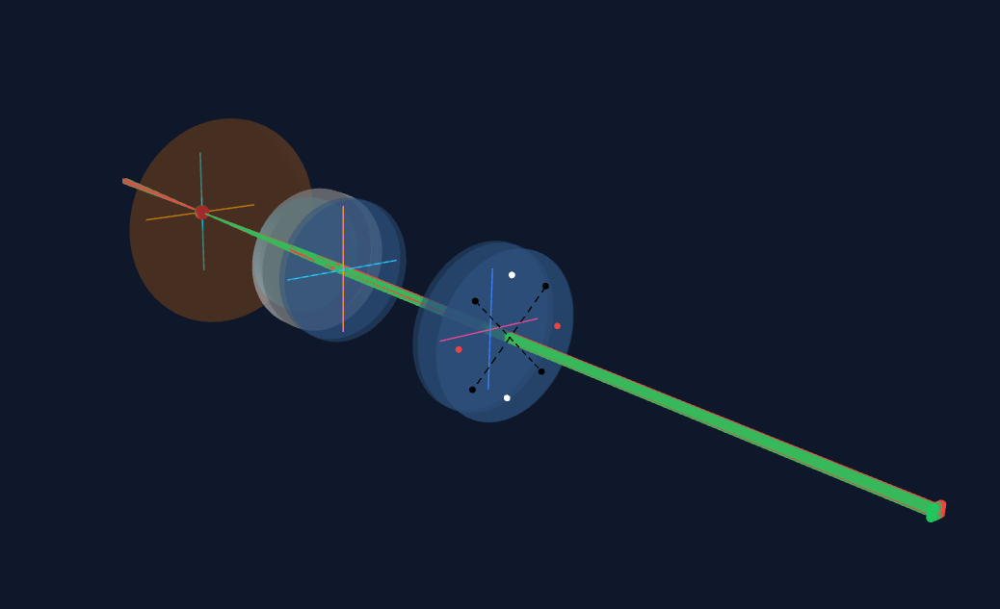

# scax-wc

Lit + Three.js 기반 안경광학 시뮬레이션(단안 기준, OD) 웹 컴포넌트 입니다.  
Lit + Three.js based ophthalmic optics simulation web component (monocular, OD).



## 설치

```bash
npm install scax-wc lit three
```

## 사용법

```ts
import 'scax-wc';
```

```html
<scax-wc></scax-wc>
```

기본 크기는 `16:9` 비율이며, 부모 컨테이너 크기에 맞춰 렌더링됩니다.

### 기본 예제 (`config` 속성)

```html
<scax-wc
  config='{
    "eyeModel":"gullstrand",
    "eye":{"s":-2,"c":-0.5,"ax":180},
    "lens":[{"s":1.0,"c":-1.0,"ax":90,"diameter":6.0,"type":"lens"}],
    "light_source":{"type":"grid","width":10,"height":10,"division":4,"z":-10,"vergence":0},
    "pupil_type":"neutral",
    "render":{"pupil":true}
  }'
  color='{
    "scene":{"background":"#020617"},
    "surface":{"cornea":"#e2e8f0","retinaOrSphericalImage":"#f97316"},
    "ray":{"default":"#facc15"},
    "lightSource":{"default":"#fde047"},
    "compound":{"strongNear":"#f59e0b","weakFar":"#06b6d4"},
    "ui":{"hostBorder":"#334155","hostBackground":"#0f172a"}
  }'
></scax-wc>
```

### 동적 설정 및 결과 접근 (JavaScript)

```ts
import 'scax-wc';

const el = document.querySelector('scax-wc');
if (el) {
  el.config = {
    eyeModel: 'gullstrand',
    eye: { s: -2, c: -0.5, ax: 180 },
    lens: [{ s: 1.0, c: -1.0, ax: 90, diameter: 6.0, type: 'cross-cylinder' }],
    light_source: { type: 'grid', width: 10, height: 10, division: 4, z: -10, vergence: 0 },
    pupil_type: 'neutral',
    render: { pupil: true }, // 동공(aperture stop) 메쉬 표시
  };
  el.color = {
    scene: { background: '#020617' },
    surface: { cornea: '#e2e8f0', retinaOrSphericalImage: '#f97316' },
    ray: { default: '#facc15' },
    lightSource: { default: '#fde047' },
    ui: { hostBorder: '#334155', hostBackground: '#0f172a' },
  };

  const simulateResult = el.getSimulateResult();
  const sturmResult = el.getSturmResult();
  const affineResult = el.getAffineResult();
}
```

### 카메라/뷰 제어

```html
<scax-wc projection="orthogonal" enable-zoom enable-pan enable-rotate></scax-wc>
```

- `projection`: `perspective` | `orthogonal`
- `enable-zoom`: 줌 허용 여부
- `enable-pan`: 팬 허용 여부
- `enable-rotate`: 회전 허용 여부

```ts
const el = document.querySelector('scax-wc');
if (el) {
  el.projection = 'perspective';
  el.enableZoom = true;
  el.enablePan = true;
  el.enableRotate = false;

  const cameraState = el.getCameraState();
  localStorage.setItem('scax-camera-state', JSON.stringify(cameraState));

  const raw = localStorage.getItem('scax-camera-state');
  if (raw) {
    el.setCameraState(JSON.parse(raw));
  }
}
```

`getCameraState` / `setCameraState`는 `perspective`와 `orthogonal` 모두 복원할 수 있도록 `projection`, `position`, `target`, `zoom`을 포함합니다.  
`getCameraState` / `setCameraState` includes `projection`, `position`, `target`, and `zoom` so both `perspective` and `orthogonal` views can be restored.

## `<scax-wc>` API

### 프로퍼티

#### `config`

- 타입: `ScaxRenderConfig`
- 속성: `config` (JSON 문자열)
- 기본값:

```json
{
  "eyeModel": "gullstrand",
  "eye": { "s": 0, "c": 0, "ax": 0 },
  "lens": [],
  "light_source": {
    "type": "grid",
    "width": 10,
    "height": 10,
    "division": 4,
    "z": -10,
    "vergence": 0
  },
  "pupil_type": "neutral",
  "render": {
    "pupil": false
  }
}
```

동작 방식:

- 문자열 속성으로 전달되면 JSON으로 파싱한 뒤 기본값과 병합합니다.
- 속성이 없거나 빈 값이거나 잘못된 JSON이면 기본 설정을 사용합니다.

주요 필드:

- `eyeModel`: 안구 모델 이름 (기본값: `gullstrand`)
- `eye`: 안구 굴절 설정 (`s`, `c`, `ax`)
- `lens`: 렌즈 배열. 각 항목은 엔진 렌즈 필드와 `diameter`, `type`(`lens` | `cross-cylinder`)을 지원합니다.
- `light_source`: 광원 설정 (`type`, `width`, `height`, `division`, `z`, `vergence`)
- `pupil_type`: 동공 타입
- `render.pupil`: 동공(aperture stop) 메쉬 렌더링 여부 (`true` 시 검은색 메쉬로 렌더링, 기본값: `false`)

#### `color`

- 타입: `ScaxColorTheme`
- 속성: `color` (JSON 문자열)
- 기본값: 내부 기본 팔레트(기존 하드코딩 색상과 동일)

동작 방식:

- 문자열 속성으로 전달되면 JSON으로 파싱한 뒤 기본 팔레트와 병합합니다.
- 속성이 없거나 빈 값이거나 잘못된 JSON이면 기본 팔레트를 사용합니다.

주요 필드:

- `surface`: 표면 색상 (`apertureStop`, `cornea`, `retinaOrSphericalImage`, `compound`, `toric`, `aspherical`, `default`)
- `ray.default`: 광선 기본 색상 (`ray.displayColor`가 없을 때 사용)
- `lightSource.default`: 광원 마커 기본 색상
- `compound`: Sturm/난시 라인 색상 (`strongNear`, `weakFar`)
- `eye`: 유도 난시 기준 메리디안 색상 (`basePrimary`, `baseSecondary`)
- `lens`: 렌즈 메리디안 색상 (`primary`, `secondary`, `cross.plusMarker`, `cross.minusMarker`, `cross.bisector` 등)
- `sturm.centerFallback`: Sturm 중심점 fallback 색상
- `scene.background`: Three.js scene 배경색
- `light.directional` / `light.ambient`: 기본 광원 색상
- `ui.hostBorder` / `ui.hostBackground`: 컴포넌트 외곽선/배경 색상

#### `projection`

- 타입: `'perspective' | 'orthogonal'`
- 속성: `projection`
- 기본값: `perspective`

#### `enableZoom`

- 타입: `boolean`
- 속성: `enable-zoom`
- 기본값: `true`

#### `enablePan`

- 타입: `boolean`
- 속성: `enable-pan`
- 기본값: `true`

#### `enableRotate`

- 타입: `boolean`
- 속성: `enable-rotate`
- 기본값: `true`

### 메서드

#### `getSimulateResult<T = unknown>(): T | null`

- 최신 `simulate()` 결과를 반환합니다.

#### `getSturmResult<T = unknown>(): T | null`

- 최신 Sturm 계산 결과를 반환합니다.

#### `getAffineResult(): { a, b, c, d, e, f, count, residualAvgPct?, residualMaxPct?, residuals? } | null`

- 광선 추적 결과로 계산된 아핀 왜곡 추정값을 반환합니다.
- Returns affine distortion estimation from ray-tracing results.

#### `getCameraState(): { projection: 'perspective' | 'orthogonal', position: { x: number; y: number; z: number }, target: { x: number; y: number; z: number }, zoom: number }`

- 현재 카메라 상태 스냅샷을 반환합니다.
- Returns a serializable snapshot of the current camera state.

#### `setCameraState(state: { projection?: 'perspective' | 'orthogonal', position?: { x?: number; y?: number; z?: number }, target?: { x?: number; y?: number; z?: number }, zoom?: number }): void`

- 카메라 상태를 런타임에서 복원합니다.
- `projection`, `position`, `target`, `zoom`을 적용하여 `perspective`/`orthogonal` 뷰를 모두 복원할 수 있습니다.
- 생략된 값은 현재 상태를 유지합니다.
- Restores camera state at runtime.
- Applies `projection`, `position`, `target`, and `zoom` to restore both `perspective` and `orthogonal` views.
- Omitted fields keep their current values.

### 이벤트

- 현재 이 컴포넌트는 커스텀 이벤트를 디스패치하지 않습니다.

## 개발

```bash
npm install
npm run check
npm run build
```

## npm 배포

```bash
npm login
npm publish --access public
```
